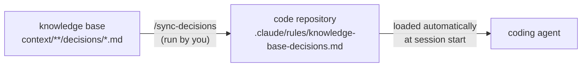

# decisions-bridge

Carries the decisions recorded in this knowledge base into a separate code repository, so
the agent working on the code starts every session knowing them.

The knowledge base is where you settle things: the system boundary, the module map, why a
format was chosen. The code lives in another repository, and an agent opened there reads
only that repository. Without a bridge it has never heard of the boundary — and builds a
module straight across it.

## How it works



1. You record a decision as a file in an entity's `decisions/` folder (format:
   `CLAUDE.md` → **Decisions**).
2. You run `/sync-decisions` (or the script). It collects every decision with
   `status: accepted` from the configured sources and writes them into **one** generated
   file in the code repository.
3. The next session opened in the code repository loads that file on its own.

**Why `.claude/rules/`.** Claude Code loads every Markdown file in a project's
`.claude/rules/` directory at startup, with the same standing as the project's
`CLAUDE.md`. That lets the bridge own exactly one file and touch nothing else — no import
line to add to the code repository's `CLAUDE.md`, nothing to merge, and deleting the file
removes the bridge completely. The path is configurable (`output`) if you want something
else; see *Other agents* below.

## Three properties, on purpose

| Property | What it means |
|---|---|
| **Explicit** | It runs only when somebody runs it. No hook, no watcher, no CI. You know when the code repository learnt a decision, because you carried it across. |
| **One-way** | The knowledge base stays the source of truth. The code repository gets a reflection, marked as generated at the top — for the human and for the agent. An edit made there is overwritten on the next run. |
| **Owned** | It writes one file and nothing else in the code repository, and refuses to overwrite a file at that path it did not generate. It never runs git there. |

Only `accepted` decisions are carried. A `proposed` one is not a decision yet, and a
`superseded` one is exactly what the code must stop following. A malformed decision file
stops the run **before anything is written** — a reflection silently missing one decision
would look identical to a complete one.

The output is deterministic: the same decisions give the same bytes, with `\n` line
endings on every system. Running it twice changes nothing, and a teammate on Windows does
not see the file as rewritten by one on macOS.

## Configure once

`tools/decisions-bridge/config.yaml`:

```yaml
targets:
  - name: erp
    repo: ../erp-system            # the code repository, next to this one
    sources:
      - context/projects/ERP       # this entity's decisions/
      - context                    # organisation-wide ones, in context/decisions/
```

Relative paths resolve against the **root of the knowledge base**, not the directory you
run from — so `../erp-system` means "the folder next to this repository" on Windows and
POSIX alike. Absolute paths and `~` work too; forward slashes are fine on Windows.

## Run

```bash
python tools/decisions-bridge/bridge.py                  # every configured target
python tools/decisions-bridge/bridge.py --target erp     # one target
python tools/decisions-bridge/bridge.py --check          # exit 1 if a target is out of date
python tools/decisions-bridge/bridge.py --dry-run        # print the file, write nothing

# one-off, without touching the config
python tools/decisions-bridge/bridge.py --repo ../erp-system --source context/projects/ERP
```

In a Claude Code session opened in the knowledge base, `/sync-decisions` does the same and
walks you through adding a target the first time.

**Exit code:** `0` written or already up to date; `1` when `--check` finds a target out of
date; `2` on a usage, config or decision-file error — nothing is written.

## In the code repository

Commit the generated file there like any other: then everybody working on the code, and
every agent session including ones in CI, sees the same decisions. The bridge does not
commit for you — the code repository's history is yours.

A change of decision goes the other way round, and only that way: edit or supersede the
decision in the knowledge base, then run the bridge again.

### Other agents

Tools that read `AGENTS.md` instead of `.claude/`, and have no import syntax, need one
line pointing at the file — written once, by you:

```markdown
Before starting, read `.claude/rules/knowledge-base-decisions.md` — the decisions this
code has to follow. It is generated from the knowledge base; do not edit it.
```

Or set `output: docs/DECISIONS.md` and reference that path from both `CLAUDE.md`
(`@docs/DECISIONS.md`) and `AGENTS.md`.

## Tests

```bash
python -m unittest tools/decisions-bridge/test_bridge.py
```
